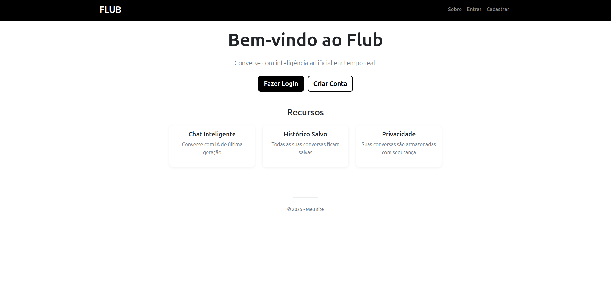

# Flub

acesse: - URL do Flub: https://projeto-chat-lvk8.onrender.com



[](https://www.python.org/)
[](https://flask.palletsprojects.com/)
[](https://www.docker.com/)
[](https://github.com/jefferson1707/projeto_chat/actions)
[](LICENSE)

---

## Descrição

Flub é um  chat I.A composto por um usuario e uma API do Gemini, com proposito demonstrativo de habilidades do desenvolvedor em back-end e criatividade.

Projeto sendo o foco em  back-end de estrutura monolitica, ele traz elementos de DevOps.

Desenvolvida em Python (Flask) que permite interações com um modelo de IA conversacional.
O sistema possui autenticação de usuários, histórico de conversas, edição de perfil e integração com modelos de linguagem. 


---

## Estrutura do Projeto

```
projeto_chat/
├── app/                     # Aplicação principal Flask
│   ├── __init__.py
│   ├── models.py            # Modelos do banco de dados
│   ├── forms.py             # Formulários Flask-WTF
│   ├── services/            # Serviços externos (Gemini, etc.)
│   ├── routes/              # Rotas organizadas por módulo
│   ├── templates/           # Templates Jinja2 (HTML)
│   └── static/              # Arquivos estáticos (CSS, JS)
|
├── .github/workflows/       # CI/CD e k8s-deploy
│
├── infra/                   # Automação de infraestrutura (Terraform)
├── k8s/                     # Manifests Kubernetes (deploy, service, ingress)
│
├── config.py                # Configurações Flask
├── run.py                   # Ponto de entrada da aplicação
├── requirements.txt         # Dependências Python
├── Dockerfile               # Build da imagem Docker
├── docker-compose.dev.yml   # Configuração Docker Compose
├── setup-dev.sh             # Script para setup de ambiente
├── ansible.cfg              # Configuração Ansible
```

---

## Tecnologias Utilizadas

- **Python 3.10+**
- **Flask**: esturtura monolitica
- **SQLite**: como e para aprendizado, usei um DataBase mais leve
- **Gemini API / IA Conversacional**
- **Docker & Docker Compose**
- **Kubernetes (K8s)**
- **Terraform / Ansible**

---

## Instalação e Execução

### Instalação Local (Desenvolvimento)

1. Clone o repositório:
   ```bash
   git clone https://github.com/jefferson1707/projeto_chat.git
   cd projeto_chat
   ```

2. Crie e ative um ambiente virtual:
   ```bash
   python -m venv venv
   source venv/bin/activate  # Linux / macOS
   venv\Scripts\activate     # Windows
   ```

3. Instale as dependências:
   ```bash
   pip install -r requirements.txt
   ```

4. Configure as variáveis de ambiente:
   ```bash
   cp .env.example .env
   ```

5. Execute a aplicação:
   ```bash
   python run.py
   ```

6. Acesse:
   ```
   http://localhost:5000
   ```

---

### Execução com Docker

1. Construa e execute os containers:
   ```bash
   docker-compose -f docker-compose.dev.yml up --build
   ```

2. Acesse a aplicação:
   ```
   http://localhost:5000
   ```

3. Para encerrar:
   ```bash
   docker-compose down
   ```

---

### Deploy com Kubernetes

1. Aplique os manifests:
   ```bash
   kubectl apply -f k8s/
   ```

2. Verifique os pods:
   ```bash
   kubectl get pods
   ```

3. Acesse via Ingress:
   ```
   http://<SEU_DOMINIO_OU_IP>
   ```

---

### Infraestrutura como Código (Terraform)

1. Acesse a pasta `infra/`:
   ```bash
   cd infra
   ```

2. Inicialize e aplique:
   ```bash
   terraform init
   terraform apply
   ```

3. Os recursos serão criados conforme os arquivos `main.tf` e `provider.tf`.

---

## Testes

Para executar os testes automatizados:
```bash
pytest test_app.py
```

---

---

## Estrutura da Aplicação Flask

```
app/
├── routes/          # Controladores (lógica das páginas)
├── templates/       # Páginas HTML (divididas em módulos)
├── static/          # Arquivos estáticos (CSS, JS, imagens)
├── models.py        # Modelos ORM
├── forms.py         # Formulários Flask-WTF
└── services/        # Integração com APIs externas (Gemini)
```

---

## Contribuição

1. Faça um fork do projeto  
2. Crie uma branch para sua feature:
   ```bash
   git checkout -b feature/minha-feature
   ```
3. Faça o commit:
   ```bash
   git commit -m "feat: nova funcionalidade"
   ```
4. Envie a branch:
   ```bash
   git push origin feature/minha-feature
   ```
5. Abra um Pull Request

---

## Licença

Este projeto está licenciado sob a [MIT License](LICENSE).

---

## Contato

**Autor:** Jefferson  Amorim
**Instagram:** @jeff_fe96 ( https://www.instagram.com/jeff_fe96/?next=%2F )
**Repositório:** [github.com/jefferson1707/projeto_chat](https://github.com/jefferson1707/projeto_chat)
